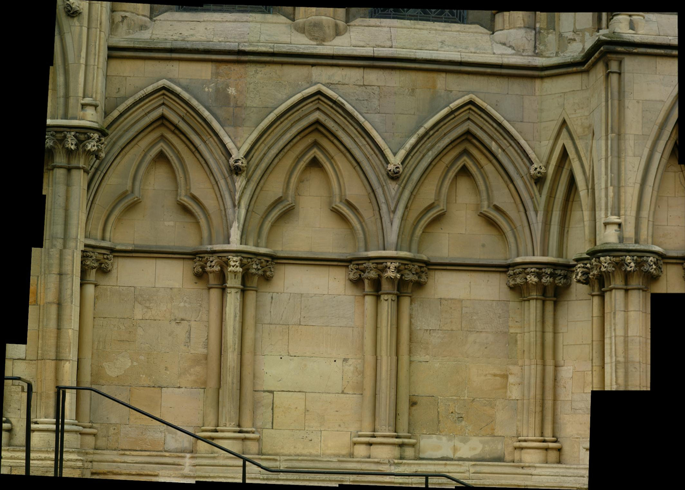
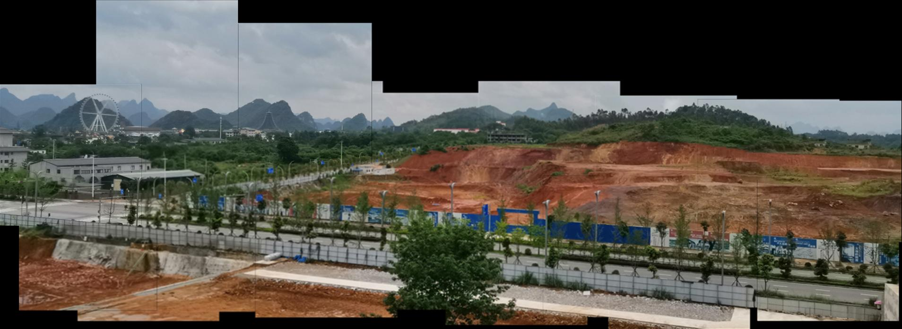
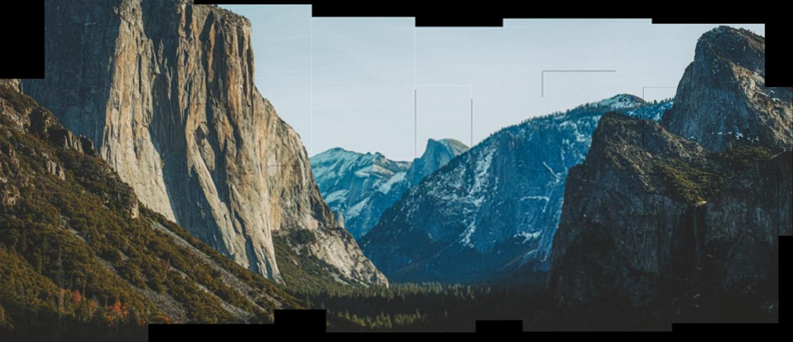
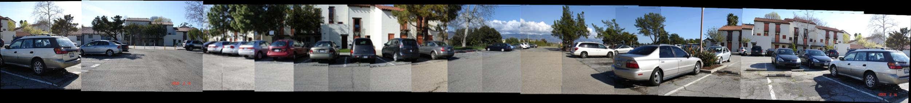
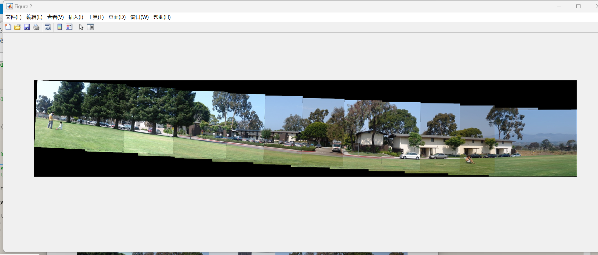

# ChurchImagePanorama

## 项目成果
本项目成功实现了基于相位相似性评分（PSS）与 SIFT 算法的教堂图像拼接。处理 20 张图像，总耗时约 20 秒，最终效果理想，满足全部任务要求。

## 项目描述
"ChurchImagePanorama" 项目采用 PSS 算法进行图像相似性评估和 SIFT 算法进行特征提取与图像拼接。项目包含以下关键步骤：
- 图像读取与灰度转换
- 相位相似性评分计算
- 关键点检测与特征匹配
- RANSAC 算法确定最佳变换模型
- 仿射变换与图像拼接

## 目录结构与使用说明
- dataset/
- ├── test_data/
- ├──教堂图像/
- KeypointDetect/
- ├── main_PSS.m
- ├── main_SIFT.m
- Result/
- ├── SIFT_output_plots/

## 运行方式
使用 MATLAB 打开 `main_PSS.m` 或 `main_SIFT.m` 文件，调整图片数量与路径，运行文件。

## 代码泛化功能
项目代码已在不同类型的测试集上进行了测试，展示了良好的泛化能力。

## 代码功能局限性
- 拼接速度有待提升，目前平均速度为 1 张/秒。
- 低质量数据处理表现不稳定，关键点索引可能存在问题。

## 致谢
感谢以下资源的数据集和代码指导：
- [Panoramic Image Stitching](https://github.com/YICHENG-LAI/Panoramic-Image-Stitching)
- [Image alignment and stitching with MATLAB](https://github.com/ethanhe42/panorama)

## 参考文献
1. David G. Lowe. Distinctive image features from scale-invariant keypoints. IJCV2004.
2. Tuytelaars T, Mikolajczyk K. Local invariant Feature Detectors: A Survey. Foundations and Trends in Computer Graphics and Vision, 2008.
3. JingLi, Nigel M. Allinson. A comprehensive review of current local features for computer vision. Neurocomputing 2008.
4. 《Auto-sorting scheme for image ordering applications in image mosaicing》
